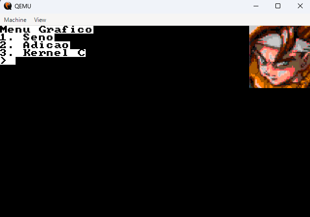

# Projeto Bootloader x86 Multiestágio com Menu Gráfico e Kernel em C

Este projeto implementa um sistema operacional básico que inicia através de um bootloader personalizado. Ele apresenta um menu gráfico interativo (Modo VGA 13h), executa operações matemáticas usando a FPU (Floating Point Unit) e carrega um Kernel escrito em C em modo protegido (32-bit).

## 📸 Demonstração

### Screenshots



<!-- ### Vídeo de Demonstração -->

<!-- Adicione o link do seu vídeo no YouTube aqui -->

## ⚠️ Aviso Importante

> **RECOMENDAÇÃO:** É altamente recomendado executar e compilar este projeto em um ambiente **Linux** (nativo ou via WSL2 no Windows). A configuração de ferramentas de compilação cruzada (Cross-Compilers) e utilitários como `dd` e `make` é significativamente mais simples e estável no Linux.

## 📂 Estrutura de Arquivos

Aqui está uma explicação detalhada da função de cada arquivo no projeto:

### Bootloader e Inicialização

-   **`boot.asm`**: O Bootloader Estágio 1 (MBR). É o primeiro código executado pela BIOS. Ele carrega o Estágio 2 do disco para a memória.
    
-   **`boot_dumped.asm`**: Um arquivo gerado por _disassembly_ para depuração, mostrando como o código de máquina do bootloader é interpretado.
    
-   **`stage2.asm`**: O Estágio 2. Contém a lógica do menu gráfico, desenha o logo, carrega fontes e gerencia a seleção do usuário.
    
-   **`stage2_dumped.asm`**: Versão desassemblada do estágio 2 para fins de debug.
    

### Funcionalidades Matemáticas (Modo Real 16-bit)

-   **`math_sin.asm`**: Programa assembly que calcula o Seno de um ângulo usando a FPU x87 e exibe o resultado.
    
-   **`math_add.asm`**: Programa assembly que solicita dois números ao usuário, soma-os e exibe o resultado.
    
-   **`math_sub.asm` / `math_sub.bin`**: Versão binária e fonte de uma rotina de subtração simples.
    

### Kernel C (Modo Protegido 32-bit)

-   **`c_loader.asm`**: Um "trampolim". Ele prepara o ambiente (Habilita A20 line, carrega GDT) e alterna o processador de 16-bit (Real) para 32-bit (Protegido) antes de pular para o Kernel C.
    
-   **`kernel.c`**: O núcleo do sistema escrito em linguagem C.
    
-   **`kernel_asm.asm`**: Ponto de entrada em Assembly para o código C, necessário para configurar a pilha e chamar a função `main`.
    
-   **`linker.ld`**: Script do linker que define como o Kernel C deve ser montado na memória (ex: definindo o endereço base `0x20000`).
    

### Recursos e Ferramentas

-   **`Makefile`**: Script de automação que compila, monta e gera a imagem final (`floppy.img`).
    
-   **`font.asm` / `font.bin`**: Dados da fonte bitmap 8x8 usada para escrever texto no modo gráfico.
    
-   **`logo.img`**: Dados binários brutos da imagem exibida no menu.
    
-   **`debug.gdb`**: Script para facilitar a depuração remota com GDB.
    

## 🛠️ Instalação das Ferramentas

Para compilar este projeto, você precisará de: `NASM` (Assembler), `GCC` (Cross-Compiler i686-elf), `Make` e `QEMU` (Emulador).

### 🐧 No Linux (Debian/Ubuntu/Mint)

Abra o terminal e execute:

```
# 1. Instalar ferramentas básicas
sudo apt update
sudo apt install build-essential nasm qemu-system-x86 make

# 2. Instalar o compilador cruzado (Cross-Compiler)
# Nota: Se o pacote 'gcc-i686-linux-gnu' não estiver disponível, 
# você pode usar o gcc padrão com a flag -m32, mas precisará editar o Makefile 
# trocando 'i686-elf-gcc' por 'gcc -m32'.
sudo apt install gcc-multilib

```

### 🪟 No Windows

A maneira mais fácil é usar o **MSYS2**.

1.  Baixe e instale o [MSYS2](https://www.msys2.org/ "null").
    
2.  Abra o terminal `MSYS2 MinGW 64-bit` e execute:
    

```
# Atualizar pacotes
pacman -Syu

# Instalar NASM, Make e QEMU
pacman -S mingw-w64-x86_64-nasm make mingw-w64-x86_64-qemu

# Instalar Toolchain de C (GCC)
pacman -S mingw-w64-x86_64-gcc

```

_Nota: No Windows, certifique-se de que os caminhos para o `nasm` e `make` estejam nas Variáveis de Ambiente do sistema se não for rodar pelo terminal do MSYS2._

## 🚀 Como Executar

Após instalar as dependências, siga os passos abaixo.

### 1. Compilar o Projeto

Abra o terminal na pasta do projeto e digite:

```
make

```

Isso irá gerar o arquivo `floppy.img`.

### 2. Executar no Emulador

Para iniciar o sistema operacional:

```
make run
# Ou manualmente:
qemu-system-i386 -fda floppy.img

```

### 3. Limpar arquivos temporários

Para apagar os binários (.bin, .o, .elf) e recompilar do zero:

```
make clean

```

## 🎨 Criação de Assets Gráficos (Logo)

A imagem `logo.img` exibida no menu não é um arquivo BMP ou PNG comum. Ela é um dump cru (RAW) de índices de cores que correspondem diretamente à memória de vídeo VGA.

Para criar ou editar essa imagem, utilizamos o **GIMP** seguindo rigorosamente este processo:

1.  **Dimensões:** A imagem deve ter **64x64 pixels**.
    
2.  **Paleta de Cores (VGA 256):** O modo VGA 13h utiliza uma paleta específica de 256 cores. Para que as cores apareçam corretamente no emulador, você deve usar a paleta disponível neste Gist:
    
    -   🔗 [Gist: VGA 256 Color Palette (TatuArvela)](https://gist.github.com/TatuArvela/c66de7e0174a54bc6231be85dd4e4e7f "null")
        
    -   _Baixe o arquivo `.gpl` (GIMP Palette) deste link e importe no GIMP._
        
3.  **Modo de Imagem:** A imagem deve ser convertida para **Modo Indexado**.
    
    -   Vá em `Imagem` > `Modo` > `Indexado...`.
        
    -   Escolha "Usar paleta personalizada" e selecione a paleta VGA que você importou.
        
    -   Isso garante que cada pixel seja salvo como um byte (0-255) representando o índice da cor.
        
4.  **Exportação:**
    
    -   Exporte a imagem como **Raw image data** (`.data` ou `.bin`). No GIMP, você pode precisar selecionar "Outros" ou digitar a extensão manualmente e selecionar o tipo de arquivo "Raw Image Data".
        
    -   O arquivo resultante não terá cabeçalho, contendo apenas os bytes de cor sequenciais, pronto para ser carregado na memória `0xA000` pelo Assembly

## 📚 Guia de Comandos de Desenvolvimento

Abaixo, a explicação dos comandos utilizados durante o desenvolvimento e presentes no Makefile ou fluxo de debug:

### 1. `make`

-   **O que faz:** Lê o arquivo `Makefile` e executa as instruções para compilar apenas os arquivos que foram modificados.
    
-   **Quando usar:** Sempre que você alterar um código fonte (.asm ou .c) e quiser gerar uma nova imagem do sistema (`floppy.img`).
    

### 2. `make clean`

-   **O que faz:** Remove todos os arquivos gerados pela compilação (binários, objetos, imagens), deixando apenas o código fonte.
    
-   **Quando usar:** Quando quiser garantir uma compilação "limpa" do zero ou antes de enviar o projeto para outra pessoa.
    

### 3. `qemu-system-i386 -fda floppy.img`

-   **O que faz:** Inicia o emulador QEMU simulando um processador Intel 386 de 32 bits.
    
    -   `-fda floppy.img`: Diz ao QEMU para usar o arquivo `floppy.img` como se fosse um disquete (Floppy Disk A) inserido na máquina.
        
-   **Quando usar:** Para testar e rodar o seu sistema operacional.
    

### 4. `qemu-system-i386 -S -s -fda .\floppy.img`

-   **O que faz:** Inicia o QEMU em modo de **Depuração (Debug)**.
    
    -   `-S`: Congela a CPU na inicialização (Startup). O sistema não roda até você mandar.
        
    -   `-s`: Abre uma porta GDB no endereço `localhost:1234`.
        
-   **Quando usar:** Quando o seu código trava ou não funciona como esperado. Você usa este comando e, em outra janela, conecta um depurador (GDB) para inspecionar a memória e registradores passo-a-passo.
    

### 5. `ndisasm -b 16 -o 0x7000 .\stage2.bin > stage2_dumped.asm`

-   **O que faz:** Usa o **N**etwide **Disasm**bler (parte do pacote NASM) para fazer a engenharia reversa de um arquivo binário, transformando-o de volta em instruções Assembly legíveis.
    
    -   `-b 16`: Informa que o código é 16-bit (Modo Real).
        
    -   `-o 0x7000`: Informa ao desassemblador que esse código foi feito para rodar no endereço de memória `0x7000` (Origin), garantindo que os saltos (JMP) e endereços de variáveis sejam calculados corretamente.
        
    -   `> stage2_dumped.asm`: Salva a saída em um arquivo de texto.
        
-   **Quando usar:** Para verificar se o binário gerado está correto ou para entender o que um binário desconhecido está fazendo. É muito útil para confirmar se os offsets de memória estão alinhados com o que você planejou no seu código fonte.

### 6. `gdb -x .\debug.gdb`

-   **O que faz:** Inicia o depurador GDB e executa automaticamente os comandos listados no arquivo `debug.gdb`.
    
    -   `-x <arquivo>`: Significa "eXecute". Diz ao GDB para ler comandos de um arquivo script ao invés de esperar você digitá-los manualmente.
        
    -   `.\debug.gdb`: É o arquivo de script que geralmente contém comandos como `target remote localhost:1234` (para conectar ao QEMU), definições de arquitetura (`set architecture i8086`) e pontos de parada (`break *0x7C00`).
        
-   **Quando usar:** Imediatamente após rodar o comando do QEMU com as flags `-S -s`. Isso conecta seu terminal ao emulador para que você possa controlar a execução do sistema operacional passo a passo.